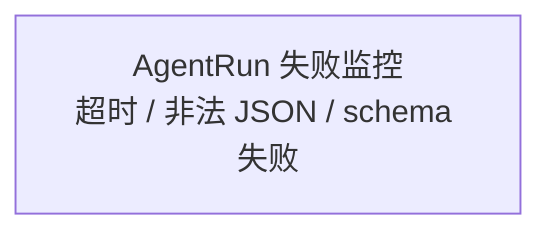

# Beautiful Mermaid

Render Mermaid source files through `lukilabs/beautiful-mermaid` and keep diagram artifacts reproducible.

## When To Use

Use this skill when the task involves:

- Beautifying or rendering `.mmd`, `.mermaid`, or Mermaid code blocks.
- Regenerating SVGs for documentation diagrams.
- Replacing a plain Mermaid CLI render with `beautiful-mermaid`.
- Producing a polished SVG or terminal ASCII preview from Mermaid source.

If the user explicitly requests the official Mermaid CLI or `mmdc`, use `mmdc` instead. If `beautiful-mermaid` fails because it does not support a diagram syntax, fall back to `mmdc` and tell the user.

## Workflow

1. Identify the Mermaid source file and target artifact path.
   - For `docs/assets/mermaid/example.mmd`, prefer `docs/assets/mermaid/example.svg`.
   - Do not overwrite the `.mmd` source with rendered output.
2. Run the bundled renderer script:

```bash
node C:/Users/hugh.lin/.codex/skills/beautiful-mermaid/scripts/render-beautiful-mermaid.mjs input.mmd output.svg
```

3. Verify the output:
   - SVG output exists.
   - File size is greater than 0.
   - SVG output contains `<svg`.
4. If the render fails:
   - First fix Mermaid syntax if the error is source-related.
   - If `beautiful-mermaid` is unavailable, install it or ask the user to install it:

```bash
npm install -g beautiful-mermaid
```

   - If `beautiful-mermaid` cannot render the diagram type, fall back to:

```bash
mmdc -i input.mmd -o output.svg
```

## Renderer Script

The script resolves `beautiful-mermaid` in this order:

1. `BEAUTIFUL_MERMAID_NODE_PATH`, if set.
2. The current workspace `node_modules`.
3. The skill directory `node_modules`.
4. Global npm `node_modules`.

Basic options:

```bash
node C:/Users/hugh.lin/.codex/skills/beautiful-mermaid/scripts/render-beautiful-mermaid.mjs input.mmd output.svg
node C:/Users/hugh.lin/.codex/skills/beautiful-mermaid/scripts/render-beautiful-mermaid.mjs input.mmd output.svg --theme github-light
node C:/Users/hugh.lin/.codex/skills/beautiful-mermaid/scripts/render-beautiful-mermaid.mjs input.mmd output.txt --format ascii
```

Use `--format svg` by default. Use `--format ascii` only when the user asks for terminal text output.

## Diagram Source Guidance

- Keep source Mermaid readable and versionable.
- Prefer explicit line breaks in large labels:



- For Chinese diagrams, keep labels concise. Long labels make layout tall or wide regardless of renderer.
- Avoid mixing too many unrelated branches into one node. Model distinct failure points as separate nodes.

## Output Notes

In final responses, mention:

- Which `.mmd` file was rendered.
- Which output artifact was regenerated.
- Whether `beautiful-mermaid` or fallback `mmdc` was used.
- Any render limitations or manual inspection needed.
