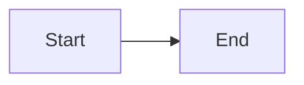
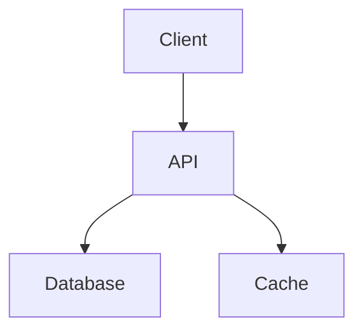

# Obsidian Flavored Markdown Skill

This skill enables Claude Code to create and edit valid Obsidian Flavored Markdown, including all Obsidian-specific syntax extensions.

## Overview

Obsidian uses a combination of Markdown flavors:
- [CommonMark](https://commonmark.org/)
- [GitHub Flavored Markdown](https://github.github.com/gfm/)
- [LaTeX](https://www.latex-project.org/) for math
- Obsidian-specific extensions (wikilinks, callouts, embeds, etc.)

## Quick Reference

### Text Formatting

```markdown
**Bold** or __Bold__
*Italic* or _Italic_
***Bold + Italic***
~~Strikethrough~~
==Highlight==
`Inline code`
```

### Headings

```markdown
# Heading 1
## Heading 2
### Heading 3
```

### Links

**Wikilinks** (Obsidian-specific):
```markdown
[[Note Name]]
[[Note Name|Display Text]]
[[Note Name#Heading]]
[[Note Name#^block-id]]
```

**Markdown links**:
```markdown
[Display Text](note.md)
[Display Text](https://example.com)
```

### Embeds

```markdown
![[Note Name]]              # Embed note
![[image.png]]              # Embed image
![[image.png|300]]          # Resize
![[document.pdf#page=3]]    # PDF page
```

### Callouts

```markdown
> [!note]
> Note content

> [!warning] Custom Title
> Warning content
```

Supported types: `note`, `info`, `tip`, `success`, `question`, `warning`, `failure`, `danger`, `bug`, `example`, `quote`, `important`, `hint`, `caution`, `missing`, `summary`, `help`

### Lists

```markdown
- Unordered list item
- Another item

1. Ordered list
2. Another item

- [ ] Task
- [x] Completed task
```

### Code Blocks

````markdown
```python
def hello():
    print("Hello")
```
````

### Tables

```markdown
| Header 1 | Header 2 |
|----------|----------|
| Cell 1   | Cell 2   |
| Cell 3   | Cell 4   |
```

### Math (LaTeX)

```markdown
Inline math: $E = mc^2$

Block math:
$$
\sum_{i=0}^n i^2 = \frac{n(n+1)(2n+1)}{6}
$$
```

### Diagrams (Mermaid)

````markdown

````

## Properties (Frontmatter)

### Basic Structure

```yaml
---
key: value
another_key: another value
list:
  - item1
  - item2
---

Content here...
```

### Common Property Types

```yaml
---
# Text
title: "My Note"
author: John Doe

# Lists
tags: [tag1, tag2, tag3]
categories:
  - category1
  - category2

# Numbers
priority: 1
count: 100

# Dates
created: 2024-01-12
modified: 2024-01-12
due_date: 2024-12-31

# Booleans
done: false
important: true
---
```

### Property Queries

Dataview plugin can query properties:

```markdown
```dataview
TABLE file.name, priority, due_date
FROM #task
WHERE !done
SORT priority ASC
```
```

## Tags

### Tag Syntax

```markdown
#tag          # Top of file for global tag
#nested/tag   # Nested tag
#multi/word/tag  # Multiple levels

Inline in sentence: #this-is-a-tag
```

### Tag Search

```markdown
[[#tag]]              # Search for tag
tag:#project          # In properties
```

## Complete Example

```markdown
---
title: "Project Overview"
tags: [project, active]
created: 2024-01-12
status: in-progress
priority: 1
---

# Project Overview

This document describes the [[Main Project]] architecture.

## Goals

- [ ] Design database schema
- [x] Create API endpoints
- [ ] Implement frontend

> [!important]
> Remember to update the [[Dependencies]] before deployment.

## Architecture



## Related Files

- [[Design Docs/UI Mockups]]
- [[API Reference]]
- 

## Notes

See also #project/planning for timeline details.
```

## Validation Rules

### Required Structure
- Valid Markdown syntax
- Proper YAML frontmatter (if properties used)
- Correct wikilink syntax: `[[Note Name]]`

### Common Mistakes
- ❌ Using wrong link syntax in wikilinks: `[[note.md]]` (use `[[note]]`)
- ❌ Missing closing code fence: ```` ``` ````
- ❌ Invalid YAML indentation (must use spaces, not tabs)
- ❌ Unclosed callout blocks

### Best Practices
1. Use wikilinks for internal notes: `[[Note]]`
2. Use markdown links for external URLs: `[text](url)`
3. Add frontmatter properties for metadata
4. Use tags for organization
5. Use callouts for important notes

## Important Notes

1. **Wikilinks**: Don't include `.md` extension in wikilinks
2. **Images**: Use `![[image.png]]` for embedded, `` for external
3. **Math**: Use `$` for inline, `$$` for block
4. **Code blocks**: Always specify language for syntax highlighting
5. **Properties**: YAML must be at the very top of the file

## Detailed Documentation

For complete syntax reference and examples, see **REFERENCE.md**:
- All Markdown formatting options
- Advanced link techniques
- All callout types and styling
- Code block syntax highlighting
- Mermaid diagram types
- Dataview query syntax
- HTML content and embeds
- Footnotes and comments
