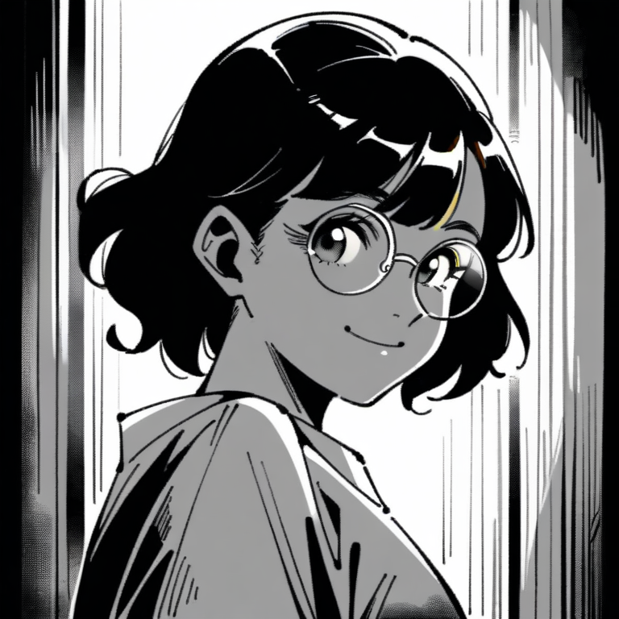
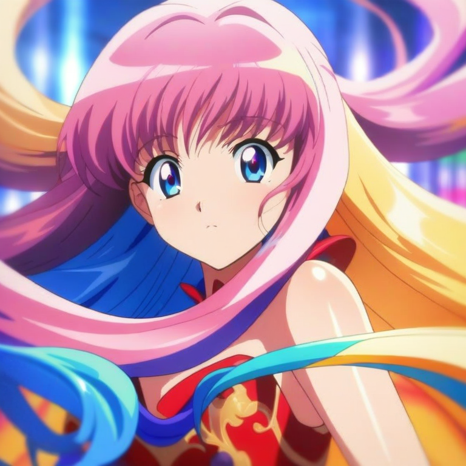

# 《Skill 工程化 06》一句话把照片变成漫画

Original hugh hugh.lingy 2026年1月16日 广东

---

## 先给结论

**解决什么：** 把"人物照片"从一张普通图片，变成风格化的漫画作品：

- 北条司风格（Hojo）：80年代《城市猎人》黑白漫画
- 漆原智志风格（Satoshi）：90年代 OVA 彩色动漫

**怎么做：** 输入一句话 + 图片，让 Claude Code 直接分析图片内容，自动生成漫画风格提示词，再调用图像生成（云端 API 或本地 ComfyUI）输出。

**效果是什么：** 你得到的不再是一次性的"对话结果"，而是一张 **风格稳定、可复现、可批量** 的漫画风格图片。

---

## 为什么要做一个"图像风格化 Skill"

在日常使用 AI 绘图时，阻力往往不在"能不能生成"，而在这三件事：

### 1. 每次都要手写提示词

- 这张照片里的人是什么发型？什么表情？穿什么衣服？
- 这些描述如果交给临场观察，成本很高，也容易遗漏。

### 2. 风格参数不稳定，导致"效果漂移"

- 同一个人一会儿画成赛博风、一会儿画成水彩风；风格和参数飘忽，后续复用很难。

### 3. 生成了图片，但没有形成"可复现的流程"

- 只在对话里给图片，不记录提示词，结果就是一次性产物；想再生成类似的，又得从头开始。

**所以这次做的是：** 把"图片分析 + 风格固化 + 生成输出"本身做成 Skill，让 Claude Code 承担分析工作，底层生成器负责风格稳定。

---

## 我们把什么做成了 Skill：Z-Image（双版本）

Z-Image 的定位只有一句话：

> **先做分析（Claude Code 看图），再做生成（API/本地），并固化风格参数。**

它的两个版本：

| 版本 | 生成方式 | 费用 | 适用场景 |
|------|---------|------|---------|
| **zimage-api** | Replicate 云端 | ~$0.003-0.009/张 | 无 GPU 用户 |
| **zimage-local** | 本地 ComfyUI | **完全免费** | 有 GPU 用户 |

输出契约是固定的：

```
outputs/zimage/
  - zimage_<style>_<timestamp>.png    (生成的图片)
```

你会注意到：**图片分析由 Claude Code 完成，不需要额外的 API 费用**。这也是它能低成本使用的前提。

---

## 这套结构为什么能"稳定复用"

### 1) 风格参数固化：不再每次调参

Skill 内置了严格的风格配置：

**北条司风格 (hojo)**
```python
{
    "trigger": "Zanshou_kin_Hojo",
    "style_prompt": "manga style, monochrome, greyscale, screentone, high contrast, ink lines",
    "negative": "color, colorful, low quality, blurry",
    "cfg": 8.0,
    "steps": 30
}
```

**漆原智志风格 (satoshi)**
```python
{
    "trigger": "sato",
    "style_prompt": "anime style, vibrant colors, glossy, shiny skin, 90s anime aesthetic",
    "negative": "monochrome, greyscale, low quality, dull colors",
    "cfg": 7.0,
    "steps": 28
}
```

核心点：**"用什么风格"被固化成配置，而不是每次重新调参。**

### 2) Claude Code 分析：提示词自动生成

当你说"帮我把这张照片转成北条司风格"，Claude Code 会：

1. **读取图片**：直接在对话里看到图片内容
2. **分析特征**：识别人物、发型、服装、表情、背景
3. **生成标签**：输出 `1girl, solo, short brown hair, glasses, smile, indoor` 这样的提示词
4. **调用生成**：把提示词传给 API 或本地 ComfyUI

**你不需要写任何提示词，Claude Code 替你完成观察和描述。**

### 3) 本地版完全免费

使用 `zimage-local` + 本地 ComfyUI：
- 图片分析：Claude Code（已包含在 Claude 订阅内）
- 图像生成：本地 GPU（免费）
- **总成本：$0**

---

## 一句话触发：三个典型例子

这里展示的是"输入长什么样"和"会生成什么"，不是让你去手动拼装流程。

### 例 1：照片 → 北条司黑白漫画

**输入一句话：**

> 帮我把 input/1.jpg 转成北条司风格

**Claude Code 执行过程：**

```
帮我把 input/1.jpg 转成北条司风格

● 好的！我来帮你把这张照片转成北条司风格的黑白漫画。

● 首先让我分析这张图片...

■ 图片分析完成

  检测到: 1girl, solo, short black hair, round glasses, white blouse,
         gentle smile, looking at viewer, portrait, upper body

● 现在调用本地 ComfyUI 生成北条司风格图像...

/zimage-local

[本地模式] 风格: hojo
[本地模式] 提示词: 1girl, solo, short black hair, round glasses...
[LocalComfyUI] 服务器: 127.0.0.1:8188
[LocalComfyUI] 风格: 北条司风格 (Hojo Tsukasa)
[LocalComfyUI] 服务器在线
[LocalComfyUI] GPU: NVIDIA GeForce RTX 2060

[生成] 提示词: , 1girl, solo, short black hair, round glasses, manga style...
[生成] 分辨率: 768x768
[生成] 种子: 871734543
[生成] 提交任务到 ComfyUI...
[生成] 等待生成完成...
[生成] 完成!
[保存] output/quick_hojo_local_1768520899.png

完成! 输出: output/quick_hojo_local_1768520899.png
```

**输出效果：**

<div align="center">

</div>

**效果特点：**
- 黑白漫画风格，高对比度
- 网点纸效果（screentone）
- 80年代《城市猎人》质感
- 清晰的线条勾勒

---

### 例 2：照片 → 漆原智志彩色动漫

**输入一句话：**

> 把这张照片转成漆原智志风格

**Claude Code 执行过程：**

```
把这张照片转成漆原智志风格

● 好的！我来把这张照片转成漆原智志风格的彩色动漫。

● 分析图片中...

■ 图片分析完成

  检测到: 1girl, solo, long flowing hair, elegant dress, bright eyes,
         beautiful, looking at viewer, portrait

● 调用本地 ComfyUI 生成漆原智志风格图像...

/zimage-local

[本地模式] 风格: satoshi
[本地模式] 提示词: 1girl, solo, long flowing hair, elegant dress...
[LocalComfyUI] 服务器: 127.0.0.1:8188
[LocalComfyUI] 风格: 漆原智志风格 (Urushihara Satoshi)
[LocalComfyUI] 服务器在线

[生成] 提示词: , 1girl, solo, long flowing hair, anime style, vibrant colors...
[生成] 分辨率: 768x768
[生成] 种子: 1752465123
[生成] 提交任务到 ComfyUI...
[生成] 等待生成完成...
[生成] 完成!
[保存] output/quick_satoshi_local_1768520967.png

完成! 输出: output/quick_satoshi_local_1768520967.png
```

**输出效果：**

<div align="center">

</div>

**效果特点：**
- 鲜艳的彩色动漫风格
- 光泽质感（glossy skin）
- 90年代 OVA 风格
- 高饱和度色彩

---

### 例 3：直接提供提示词生成

**输入命令：**

> 用 zimage-local 生成：1girl, solo, short hair, glasses, smile, portrait

**执行过程：**

```bash
$ cd .claude/skills/zimage-local
$ python generate.py "1girl, solo, short hair, glasses, smile, portrait" hojo

[Z-Image Local] 风格: hojo
[Z-Image Local] 提示词: 1girl, solo, short hair, glasses, smile, portrait
[LocalComfyUI] 服务器: 127.0.0.1:8188
[LocalComfyUI] 风格: 北条司风格 (Hojo Tsukasa)

[生成] 提示词: 1girl, solo, short hair, glasses, smile, portrait, manga style...
[生成] 分辨率: 768x768
[生成] 种子: 1234567890
[生成] 提交任务到 ComfyUI...
[生成] 等待生成完成...
[生成] 完成!
[保存] outputs/zimage/zimage_hojo_local_1737012567.png

完成! 输出: outputs/zimage/zimage_hojo_local_1737012567.png
```

---

## 风格对比一览

<table>
<tr>
<th>北条司风格 (hojo)</th>
<th>漆原智志风格 (satoshi)</th>
</tr>
<tr>
<td></td>
<td></td>
</tr>
<tr>
<td>

- 黑白漫画
- 网点纸效果
- 高对比度线条
- 80年代《城市猎人》风格

</td>
<td>

- 彩色动漫
- 光泽质感
- 鲜艳饱和度
- 90年代 OVA 风格

</td>
</tr>
</table>

---

## 两种版本对比

| 对比项 | zimage-api | zimage-local |
|--------|-----------|--------------|
| **生成方式** | Replicate 云端 API | 本地 ComfyUI |
| **需要配置** | `REPLICATE_API_TOKEN` | ComfyUI + 模型 |
| **费用** | ~$0.003-0.009/张 | 完全免费 |
| **生成速度** | 30-60秒 | 30-40秒 |
| **硬件要求** | 无 | GPU 4GB+ VRAM |
| **适用场景** | 无 GPU / 临时使用 | 有 GPU / 长期使用 |

**共同点：**
- 图片分析都由 Claude Code 完成（无额外费用）
- 风格参数完全一致
- 输出路径和命名规则相同

---

## 环境配置

### API 版配置

1. 注册 [Replicate](https://replicate.com/) 账号
2. 获取 [API Token](https://replicate.com/account/api-tokens)
3. 创建 `.env` 文件：

```env
REPLICATE_API_TOKEN=r8_xxxxxxxxxxxxxxxxxxxxxxxxxxxxxxxxxxxxxxxx
```

### 本地版配置

1. **安装 ComfyUI**
```bash
git clone https://github.com/comfyanonymous/ComfyUI.git
cd ComfyUI
pip install -r requirements.txt
```

2. **下载模型**

| 类型 | 文件 | 存放位置 |
|------|------|---------|
| Checkpoint | animagine-xl-3.1.safetensors | `ComfyUI/models/checkpoints/` |
| LoRA | 90s anime.safetensors | `ComfyUI/models/loras/` |

3. **启动 ComfyUI**
```bash
# 标准启动
python main.py --listen

# 6GB 显存用户
python main.py --listen --lowvram
```

### 安装依赖

```bash
pip install -r .claude/skills/zimage-core/requirements.txt
```

---

## 适用场景与边界

### 适用场景

- 你想把人物照片转换成 **特定漫画风格** 的图片
- 你需要 **稳定的风格输出**，避免每次调参
- 你希望 **零成本** 使用（本地版）或 **低成本** 使用（API 版）
- 你想让 **Claude Code 自动分析图片**，省去写提示词的麻烦

### 边界

- 它解决的是"风格转换"，不是"凭空创作"
- 当前只支持 **两种风格**：北条司（黑白）和漆原智志（彩色）
- 本地版需要 **GPU 支持**（最低 4GB VRAM）
- 生成质量依赖于 **输入图片的清晰度**

---

## 项目结构

```
.claude/skills/
├── zimage-api/              # API 版 Skill
│   ├── SKILL.md             # 使用文档
│   └── generate.py          # 生成脚本
├── zimage-local/            # 本地版 Skill
│   ├── SKILL.md             # 使用文档
│   └── generate.py          # 生成脚本
└── zimage-core/             # 共享核心模块
    ├── __init__.py
    ├── presets.py           # 风格预设配置
    ├── lora_generator.py    # API 生成器
    ├── local_comfyui.py     # 本地 ComfyUI 生成器
    └── requirements.txt     # 依赖文件
```

---

## 获取方式

项目已开源：

```bash
git clone https://github.com/lingengyuan/my-skills.git
cd my-skills

# 安装依赖
pip install -r .claude/skills/zimage-core/requirements.txt
```

或者点个关注，私信我或者评论区留言：**zimage**

我把这套 Skill 打包发你。

---

Skills工程化 · 目录

| 上一篇 | 下一篇 |
|-------|-------|
| 《Skill 工程化 05》一句话把想法落进 Obsidian | 敬请期待 |
